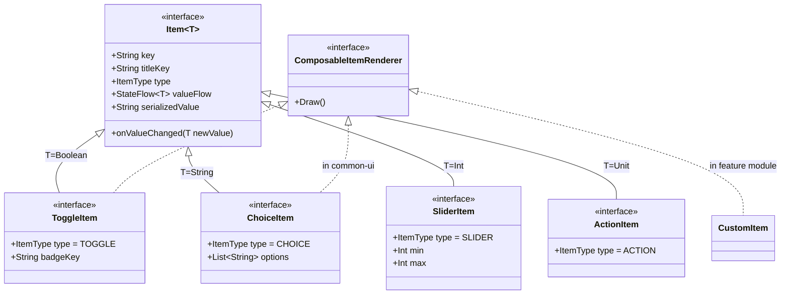

# ADR 0001: Settings Item Contract Architecture (Generic DataType & Interface ViewType)

## Status
**Accepted** *(Partially Superseded by [ADR 0003](0003-item-contract-segregation-value-and-container.md) regarding `Item<T>` segregation)*

## Context
In our modular, multi-app/multi-module Car Settings system (Android Automotive OS / In-Vehicle Infotainment):
1. **SSOT (Single Source of Truth) Requirement**: Setting items must serve as the single source of truth for both **UI rendering** (Compose/Views) and **IPC exposure** (`ContentProvider` generating dynamic `MatrixCursor`s).
2. **Framework Decoupling**: The core contract module (`:core-item-contract`) must remain a pure Kotlin module with **zero Android framework dependencies** (no `Context`, `R.string`, `R.drawable`, `View`, or `Composable`) and **zero vehicle domain coupling** (`VehicleConfig`).
3. **Type-Safe Data-Driven UI**: Settings items range from common controls (Toggle, Choice, Slider) with diverse UI variations (switch, checkbox, badge, segmented button, dropdown) to highly specialized custom controls (e.g. 2D/3D seat lumbar support, audio equalizer visualizers).

We needed to decide:
- How to model the **payload/value** of an item (DataType).
- How to model the **presentation/visual variation** of an item (ViewType).
- How to handle custom/complex items while maintaining strict HMI design consistency for standard items.

---

## Decision Drivers
- **Compile-Time Type Safety**: Prevent runtime `ClassCastException` and stringly-typed parsing errors (e.g. passing `"hello"` to a boolean switch).
- **Liskov Substitution Principle (LSP)**: Ensure writing/mutating state (`onValueChanged`) is strictly type-safe at compile time without contravariant parameter violation.
- **JVM Type Erasure in Heterogeneous Collections**: Settings screens operate on heterogeneous lists (`List<Item>`). The design must avoid runtime crashes or un-checkable erased types when pattern-matching.
- **Zero Framework Coupling**: Keep the core contract pure Kotlin.
- **Automotive HMI Consistency**: Centralize standard UI styling so OEM-wide design changes do not require refactoring every feature module.

---

## Decisions

### 1. DataType as a Generic Parameter (`Item<T>`)

> [!NOTE]
> **Evolutionary Update (ADR 0003)**:
> In the initial architecture, all items were modeled as `Item<T>`. When composite spatial containers (`ContainerItem`) and layout spacers (`SpacerItem`) were introduced, forcing all items to hold a state payload violated the Interface Segregation Principle (ISP).
> As recorded in [ADR 0003](0003-item-contract-segregation-value-and-container.md), `Item<T>` was evolved into two contracts:
> - Root identity, categorization, and visibility: non-generic `Item`
> - Reactive state observation and value mutation: `ValueItem<T> : Item`
>
> The core rationale below (why generic typing avoids boxing and preserves compile-time type safety over sealed classes) remains foundational for `ValueItem<T>`.

We decided to model the payload/state of an item using a generic type parameter `Item<T>`, rather than wrapping primitives in a sealed class hierarchy (`DataType.Bool`, `DataType.Number`).

```kotlin
interface Item<T> {
    val key: String
    val titleKey: String
    val viewType: ViewType // 👈 UI presentation specification property
    val valueFlow: StateFlow<T>
    fun onValueChanged(newValue: T)
    val serializedValue: String get() = valueFlow.value.toString()
}
```

#### Why not a sealed `DataType` wrapper (`data class Bool(val value: Boolean) : DataType`)?
- **Liskov Substitution Principle Violation on Write**:
  If `Item.onValueChanged` takes `DataType`, a sub-interface cannot narrow the parameter type:
  ```kotlin
  interface ToggleItem : Item {
      // ❌ Kotlin/Java prohibits narrowing parameter types in overrides:
      // override fun onValueChanged(newValue: DataType.Bool) // ERROR!
  }
  ```
  Consequently, `ToggleItem` would be forced to accept ANY `DataType` and perform runtime casting: `(newValue as? DataType.Bool) ?: throw IllegalArgumentException(...)`. This destroys compile-time write type safety.
- **Unboxing Fatigue & Garbage Collection Overhead**:
  Wrapping primitives (`Boolean`, `Int`) requires constant boxing/unboxing at every UI event and every VHAL (`CarPropertyManager`) boundary.
- **Why Generics Work**:
  `ToggleItem : Item<Boolean>` guarantees that `onValueChanged(newValue: Boolean)` only accepts a `Boolean` at compile time.

---

### 2. Polymorphic Item Domain Classification (`val type: ItemType`)
Rather than maintaining an artificial `ViewType` interface hierarchy and using a central `when (viewType)` dispatcher, each sub-interface declares its semantic `ItemType` polymorphically:

```kotlin
interface Item<T> {
    val key: String
    val titleKey: String
    val subtitleKey: String? get() = null
    val iconKey: String? get() = null

    // Polymorphic default: bespoke/custom items default to CUSTOM
    val type: ItemType get() = ItemType.CUSTOM

    val valueFlow: StateFlow<T>
    fun onValueChanged(newValue: T)
    val serializedValue: String get() = valueFlow.value.toString()
}

interface ToggleItem : Item<Boolean> {
    override val type: ItemType get() = ItemType.TOGGLE
    val badgeKey: String? get() = null
}

interface ChoiceItem : Item<String> {
    override val type: ItemType get() = ItemType.CHOICE
    val options: List<String>
}

interface SliderItem : Item<Int> {
    override val type: ItemType get() = ItemType.SLIDER
    val min: Int
    val max: Int
    val unitKey: String? get() = null
}

interface ActionItem : Item<Unit> {
    override val type: ItemType get() = ItemType.ACTION
}
```

---

### 3. Self-Rendering via `ComposableItemRenderer` (Zero `when` Branching)
Instead of centralizing UI row branching inside `GenericSettingsActivity` via `when`, UI rendering is delegated directly to items through the `ComposableItemRenderer` interface (`common-ui-settings`):

```kotlin
interface ComposableItemRenderer {
    @Composable
    fun Draw()
}
```

- Standard items (`ComposableToggleItem`, `ComposableChoiceItem`) inherit standard row rendering (`ToggleItemRow`, `ChoiceItemRow`).
- Bespoke custom items (`SeatLumbarSupportItem`) implement `ComposableItemRenderer` directly and render bespoke widgets (`SeatLumbarRow`).
- The host UI (`GenericSettingsScreen`) invokes `(item as? ComposableItemRenderer)?.Draw()`, achieving **100% polymorphic UI rendering with ZERO `when` statements**.
- As a result, the old `ViewType` interface hierarchy was completely obsolete and was deleted.

---

## Architecture Diagram



---

## Consequences

### Positive
- **100% Compile-Time Write Safety**: `onValueChanged` rejects invalid data types at build time.
- **Zero Runtime Reflection or 다운캐스팅**: The UI renderer receives concrete, typed items.
- **Eliminated Stringly-Typed Parsing**: UI components bind directly to `Boolean`, `Int`, or custom payload types.
- **Clean Extensibility**: Non-standard items with complex data payloads (e.g. `SeatLumbarSupport(height, depth)`) seamlessly coexist in the same `List<Item<*>>` and ContentProvider `MatrixCursor` pipeline.

### Trade-offs
- Collections must be typed as `List<Item<*>>`.
- Sub-interfaces (`ToggleItem`, `ChoiceItem`, `SliderItem`) are required as intermediate abstractions to bridge the generic type and avoid type erasure during UI dispatching.
