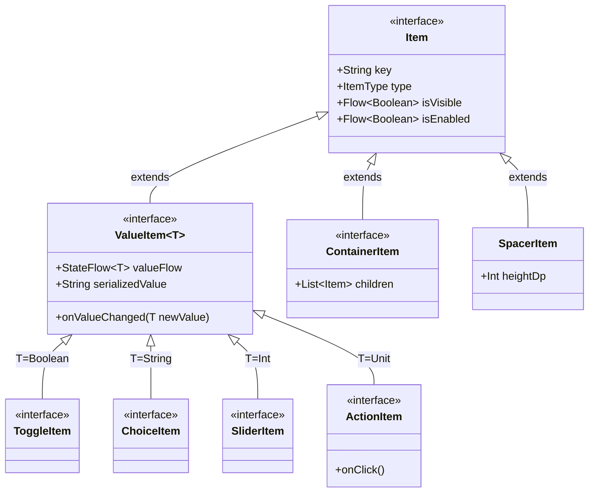

# ADR 0003: Item Contract Segregation (ValueItem vs Layout Hierarchy)

## Status
**Accepted** *(Supersedes [ADR 0001](0001-settings-item-contract-architecture.md) Section 1 regarding `Item<T>`)*

## Context
In ADR 0001, we formulated the generic `Item<T>` contract under the fundamental assumption that **every setting item in the vehicle represents a stateful property** with a reactive stream (`valueFlow: StateFlow<T>`), a value mutation entry point (`onValueChanged(newValue: T)`), and a serialized representation (`serializedValue: String`).

However, as the system evolved to support rich, data-driven vehicle cockpit interfaces, this assumption broke down:
1. **Composite & Spatial Layouts (`ContainerItem`)**:
   - Complex UI layouts, such as a single row hosting dual independent controls (e.g. Frunk & Trunk lighting toggles) or a 2D spatial vehicle canvas controlling 4 individual window positions, are structural grouping elements.
   - A container item aggregates child items; it does not have a single scalar state value of its own, nor can it accept a scalar `onValueChanged` event.
2. **Action Commands as Fixed-Value Triggers (`ActionItem`)**:
   - In automotive hardware (VHAL / CAN bus) and IPC (`ContentProvider`), actions (e.g. "Reset Trip", "Calibrate Camera") are not RPC methods; they are writes of a fixed trigger value (`1`, `true`, `"TRIGGER"`) to a specific key/property ID.
   - While earlier thought to be non-value triggers, from the data and IPC perspective an action is fundamentally a `ValueItem<Unit>` with a fixed payload.
3. **Layout Spacing & Decorative Elements (`SpacerItem`, Headers, Dividers)**:
   - Elements for visual spacing or headings belong in the layout tree and need identity (`key`) and visibility (`isVisible`), but have no state and must not pollute IPC or VHAL layers.
4. **Interface Segregation Principle (ISP) & Leaky Abstractions**:
   - Forcing non-state elements to implement dummy `valueFlow` violated ISP.
   - Conversely, making data providers check blacklist conditions like `it !is SpacerItem` leaked UI implementation details into the data layer.

---

## Decisions

### 1. Root Contract Segregation: Layout Hierarchy (`Item`) vs Data Model (`ValueItem<T>`)

We segregated the hierarchy into a clean separation between **Layout/UI Nodes** (`Item`) and **Data/IPC Entities** (`ValueItem<T>`):



#### A. Root Contract (`Item`)
Free of generic type parameters and state requirements:
```kotlin
interface Item {
    val key: String
    val type: ItemType get() = ItemType.CUSTOM
    val isVisible: Flow<Boolean> get() = flowOf(true)
    val isEnabled: Flow<Boolean> get() = flowOf(true)
}
```

#### B. Data Model Contract (`ValueItem<T>`)
Encapsulates reactive observation, mutation, and serialization for all data-bearing items (Toggles, Choices, Sliders, and Actions):
```kotlin
interface ValueItem<T> : Item {
    val valueFlow: StateFlow<T>
    fun onValueChanged(newValue: T)
    val serializedValue: String get() = valueFlow.value.toString()
}

interface ToggleItem : ValueItem<Boolean> {
    override val type: ItemType get() = ItemType.TOGGLE
}

interface ChoiceItem : ValueItem<String> {
    override val type: ItemType get() = ItemType.CHOICE
    val options: List<String>
}

interface SliderItem : ValueItem<Int> {
    override val type: ItemType get() = ItemType.SLIDER
    val min: Int
    val max: Int
    val unitKey: String? get() = null
}

/**
 * Action trigger item (e.g. "Reset Settings", "Calibrate Cameras").
 * Implements [ValueItem] with [Unit] payload representing write-to-trigger IPC and VHAL semantics.
 * Calling [onClick] delegates directly to [onValueChanged] with [Unit].
 */
interface ActionItem : ValueItem<Unit> {
    override val type: ItemType get() = ItemType.ACTION
    override val valueFlow: StateFlow<Unit> get() = MutableStateFlow(Unit)

    fun onClick() {
        onValueChanged(Unit)
    }

    override val serializedValue: String get() = "TRIGGER"
}
```

#### Why `ActionItem` is a `ValueItem<Unit>` (Write-to-Trigger Semantics)
In automotive hardware (VHAL / CAN / LIN) and IPC (`ContentProvider`), an "Action" is never an arbitrary remote RPC call; it is a write of a fixed value (e.g. `1`, `true`, `"TRIGGER"`) to a specific key/property ID.
By implementing `ValueItem<Unit>`:
1. **IPC & VHAL Unification**: The existing `onValueChanged(...)` and `METHOD_UPDATE_ITEM` pipelines handle actions without any special branching.
2. **Whitelist Data Filtering**: `items.filterIsInstance<ValueItem<*>>()` in `ContentProvider` captures `ActionItem` automatically alongside `ToggleItem`, `ChoiceItem`, and `SliderItem`, while cleanly excluding UI layout nodes (`ContainerItem`, `SpacerItem`).
3. **UI Ergonomics**: UI callers simply invoke `item.onClick()`, which internally delegates to `onValueChanged(Unit)`.

#### C. Structural & Layout Contracts (`ContainerItem`, `SpacerItem`)
Enables recursive composition of setting elements and data-driven spacing:
```kotlin
interface ContainerItem : Item {
    override val type: ItemType get() = ItemType.CONTAINER
    val children: List<Item> get() = emptyList()
}

class SpacerItem(
    val heightDp: Int = 16,
    override val key: String = "spacer_${counter.incrementAndGet()}"
) : UiItem {
    override val titleRes: Int = 0

    @Composable
    override fun Draw(modifier: Modifier) {
        Spacer(modifier = modifier.height(heightDp.dp))
    }
}
```

---

### 2. Elimination of Generics at Container and UI Boundaries

Previously, heterogeneous collections throughout the architecture required existential wildcard typing: `List<Item<*>>`.

By eliminating the type parameter from `Item`, collections across `CategoryItemProvider`, `GenericSettingsScreen`, and feature registries now use clean, unified typing:
- **Before**: `val items: List<Item<*>>`
- **After**: `val items: List<Item>`

---

### 3. Compose Modifier Propagation & Layout Spacers

To comply with Jetpack Compose component design guidelines:
1. **`ComposableItemRenderer.Draw(modifier: Modifier)`**:
   - The interface declares `fun Draw(modifier: Modifier)` without default arguments (adhering to Compose compiler overridable interface rules).
   - An `@Composable fun ComposableItemRenderer.Draw()` extension function provides default `Modifier` for parameterless invocations.
2. **`SpacerItem`**:
   - Implements `UiItem` with an automatic unique key sequence (`"spacer_${counter}"`) and explicit key support.
   - Convenience extension `Item.withSpacer(heightDp)` binds deterministic keys (`"${key}_spacer"`).
   - `GenericSettingsScreen` automatically suppresses `HorizontalDivider` below `SpacerItem`s.

---

### 4. Data Layer Whitelist Filtering (`filterIsInstance<ValueItem<*>>()`)

Rather than fragile blacklist checks (`it !is SpacerItem`) that leak UI knowledge into data providers, feature ContentProviders query:
```kotlin
val dataItems = registry.items.filterIsInstance<ValueItem<*>>()
```
- Completely decouples ContentProviders from knowing any UI layout components.
- Guarantees compile-time type-safe access to `item.serializedValue` without safe-casts.
- Captures all data items (Toggles, Choices, Sliders, Actions, and Custom values) in a single unified filter.

---

### 5. Hierarchical Resolution in `CategoryItemProvider`
`CategoryItemProvider.findItem(key: String)` performs recursive resolution across `ContainerItem.children`, allowing IPC layers and deep-link routers to address nested items transparently:
```kotlin
fun findItem(key: String): Item? {
    fun search(list: List<Item>): Item? {
        for (item in list) {
            if (item.key == key) return item
            if (item is ContainerItem) {
                val nested = search(item.children)
                if (nested != null) return nested
            }
        }
        return null
    }
    return search(items)
}
```

---

## Consequences

### Positive
- **Architectural Rigor**: Strict adherence to the Interface Segregation Principle (ISP).
- **Clean Type System**: Elimination of `List<Item<*>>` wildcard cascades throughout repositories, screens, and registries.
- **Write-to-Trigger Action Modeling**: `ActionItem` cleanly aligns with automotive hardware (VHAL) and IPC write semantics as a `ValueItem<Unit>`.
- **Complete Decoupling of Data & UI**: ContentProviders filter on `ValueItem<*>`, remaining 100% unaware of UI layout nodes (`SpacerItem`, `ContainerItem`).
- **Compose Compliance**: Standard `Modifier` propagation and predictable `LazyColumn` keying for layout spacers.

### Negative / Trade-offs
- Concrete custom value items implement `ValueItem<T>` instead of `Item<T>`.
