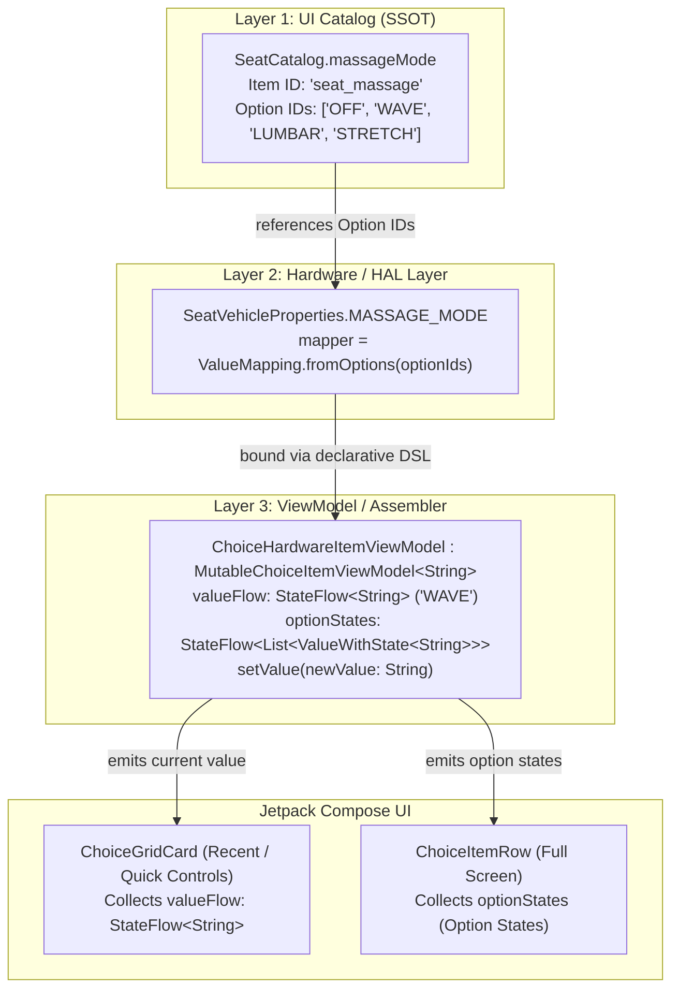

# ADR 0004: Pure Stateless UiItem Hierarchy, Data-Layer State Ownership, and Choice SSOT

## Status
**Accepted**

## Context
In ADR 0003, we established the tree-structured canonical `Item` and decoupled Jetpack Compose rendering from the data tree. However, as the automotive settings feature expanded to include complex segmented choices (e.g., Seat Massage Modes, Seat Ventilation), bespoke pneumatic lumbar controls, and quick-control dashboards, three critical architectural challenges emerged:

1. **State Leakage into UI Presentation (`UiItem`)**:
   - `UiToggleItem`, `UiChoiceItem`, and `UiSliderItem` still declared default properties like `valueFlow: StateFlow<T>` and `initialValue`.
   - Even custom items like `SeatLumbarSupportItem` inadvertently held mutable state flows.
   - This blurred the boundary between **Layer 1 (UI Presentation Metadata)** and **Layer 3 (ViewModel / State Management)**, risking split-brain defaults where a UI catalog hardcoded `initialValue = true` while the vehicle HAL or storage defaulted to `false`.

2. **Choice Item SSOT Violation with Multi-Option Dynamic State**:
   - VHAL properties have key-value pairs (e.g., `VHAL_MASSAGE_MODE` -> `1`).
   - When modeling choices (Segmented Buttons / Chips), the UI requires labels, badges, and icons, while the Data Layer dynamically computes whether an option is selectable or disabled (e.g., driving safety lockout).
   - If UI options or raw string IDs were duplicated across Catalog, VHAL properties, and ViewModels, the **Single Source of Truth (SSOT)** principle ("Item and Option IDs must be declared in exactly one place") would be violated.

3. **Layout Rigidity of `ItemRendererRegistry` vs Universal Dashboard**:
   - A settings dashboard required **Recent (Quick Controls)** on top and **Actual Categories** below.
   - Forcing all categories to render through an intermediate `ItemRendererRegistry` restricted screen layouts to flat lists and made compound arrangements (like dual toggles in one row or 2D car diagrams) difficult without introducing artificial wrapper items.

---

## Decisions

### 1. Pure, 100% Stateless `UiItem` Hierarchy
`UiItem` and all its subclasses (`UiToggleItem`, `UiChoiceItem`, `UiSliderItem`, `UiActionItem`, `BaseUiToggleItem`, `BaseUiChoiceItem`) are strictly defined as **pure, immutable presentation metadata**:
- **Zero Reactive Streams**: `valueFlow` is completely removed from all `UiItem` classes.
- **Zero Mutation Handlers**: `onValueChanged` is completely removed from all `UiItem` classes.
- **Zero Hardcoded State Defaults**: `initialValue` is completely removed from `UiItem`. UI items do not dictate domain values or default states.
- **Data Layer as Single Source of Truth for Defaults**: Initial and default values are exclusively configured in the Data Layer (`VehicleProperty.defaultValue`, `HardwarePropertyStorage.setInitialValue()`, or `LocalStorageItemViewModel(initialValue = ...)`).
- **Graceful UI Fallback**: When an item has no bound ViewModel (e.g., preview or disconnected item), Composable rows fall back to neutral widget defaults (`false`, `"-"`, `min`) with `enabled = false`.

```kotlin
@Immutable
open class UiToggleItem(
    id: String,
    @StringRes nameResId: Int,
    @DrawableRes iconResId: Int? = null,
    @StringRes descriptionResId: Int? = null,
    open val badgeKey: String? = null,
    @get:DrawableRes open val onIconRes: Int? = null,
    @get:DrawableRes open val offIconRes: Int? = null,
    children: Set<Item> = emptySet()
) : UiItem(id, nameResId, iconResId, descriptionResId, children)
```

---

### 2. Choice Item SSOT with `ValueWithState` and Dedicated `ChoiceItemViewModel<T>`
To support rich multi-option choice controls (Segmented, Chip, Icon-Only) with dynamic selection and lockout states without duplicating string literals:



- **Domain Type Preservation**: Choice items maintain their genuine domain value type `T` (e.g. `String`, or Enum). They are typed as `ChoiceItemViewModel<String>` and `MutableChoiceItemViewModel<String>`, NOT a collection type.
- **Strict Interface Segregation (No Fat Interface)**: Base `ItemViewModel<T>` exposes only `valueFlow: StateFlow<T>`. It does not force nullable collection flows onto 95% of scalar controls (Toggles, Sliders). Only `ChoiceItemViewModel<T>` introduces `optionStates: StateFlow<List<ValueWithState<T>>>`.
- **Dual Presentation Support**:
  - Passive displays & compact cards (`ChoiceGridCard`) observe `valueFlow: StateFlow<String>` directly without parsing option lists.
  - Interactive multi-choice controls (`ChoiceItemRow`) observe `optionStates: StateFlow<List<ValueWithState<String>>>` to render per-option enabled/selected buttons.
- **Natural Mutation**: `setValue(newValue: T)` directly accepts the chosen option ID (`"WAVE"`), naturally matching `MutableItemViewModel<String>`.
- **SSOT Guarantee**: Raw strings are declared only in `SeatCatalog`. The hardware mapping and ViewModel consume `SeatCatalog.massageMode.optionIds` directly.
- **Strict Hierarchical Terminology (Plan A)**:
  - **Choice**: Refers to the item/component level (`ChoiceItem`, `UiChoiceItem`, `ChoiceItemViewModel`, `ChoiceItemRow`, `ChoiceGridCard`).
  - **Option**: Refers to the candidate/element level (`UiOption`, `options: List<UiOption<String>>`, `optionIds: List<String>`, `OptionSlots`, `optionStates: StateFlow<List<ValueWithState<T>>>`, `onOptionSelected`).

---

### 3. Custom UI Items are Pure Metadata (e.g., `SeatLumbarSupportItem`)
Bespoke vehicle controls (such as 2D pneumatic lumbar adjustment) follow the exact same architectural boundary:
- `SeatLumbarSupportItem` inherits `UiItem` and defines only presentation coordinates/labels.
- `SeatLumbarViewModel` implements `ItemViewModel<SeatLumbarSupport>` and manages `valueFlow`, `setValue()`, and IPC serialization roundtrips.
- Bound in `SeatViewModelModule` via `SeatCatalog.seatLumbar bindsTo lumbarViewModel`.

---

### 4. Universal Dashboard with Recent on Top and Registry-Free Category Freedom
- **Top Section (Recent / Quick Controls)**:
  - Dynamically resolves top MRU items from `RecentCategoryManager`.
  - Renders compact square cards (`ToggleGridCard`, `ChoiceGridCard`, `SliderGridCard`) in 2-column chunks without nested scroll conflicts.
- **Bottom Section (Actual Categories)**:
  - Dynamically aggregates categories from all `CategoryItemProvider` implementations.
  - **Eliminates `ItemRendererRegistry` for Category screens**: Categories are composed directly in Jetpack Compose, enabling freeform layouts, compound rows (`DualToggleRow`), and bespoke 2D/3D car diagrams naturally.

---

### 5. Architectural Guard Enforcement via Reflection Tests
To permanently prevent regressions where state streams or mutation methods are accidentally reintroduced into `UiItem`:
- **`UiItemStatelessContractTest`**:
  - Uses reflection across `UiItem`, `UiToggleItem`, `UiChoiceItem`, `UiSliderItem`, `UiActionItem`, `BaseUiToggleItem`, and `BaseUiChoiceItem`.
  - Asserts that none of these classes declare `getValueFlow()`, `valueFlow` field, `onValueChanged()`, or `getInitialValue()`.
- **`SeatFeatureLogicTest`**:
  - Asserts that custom items like `SeatLumbarSupportItem` declare zero state properties or mutation methods.

---

### 6. Physical Separation of Layers into Dedicated Files
To eliminate monolithic file accumulation (`*Items.kt`), enforce clean git ownership (`CODEOWNERS`), and guarantee strict layer boundaries:
- **`*Catalog.kt`**: **Layer 1 (UI Presentation)** — Canonical catalog declaring item IDs, titles, descriptions, icons, and choices. Owned by UI/Design engineers (zero VHAL knowledge needed).
- **`*VehicleProperties.kt`**: **Layer 2 (Hardware / HAL)** — Vehicle HAL property IDs, area IDs, and `ValueMapping`. Owned by Vehicle/Embedded engineers (zero UI/Compose knowledge needed).
- **`*ViewModelModule.kt`**: **Layer 3 (Assembler / DI)** — Declarative `bindsTo` bindings. Owned by Platform/App engineers.
- **`*ItemRegistry.kt`**: Category registry implementing `CategoryItemProvider` for dynamic discovery and IPC traversal.
- Custom domain models & ViewModels (e.g. `SeatLumbarSupport.kt`) reside in dedicated files.

---

### 7. Interface Segregation Principle (ISP): Read-Only vs. Mutable ViewModels & Choice Specialization
Certain vehicle features require observable domain state without user mutation capability (e.g. instrument cluster telemetry, dashboard gauges, battery SOC, speed, passive passenger displays):
- **`interface ItemViewModel<T>` (Read-Only Minimal Base)**:
  - Exposes observable domain value via `val valueFlow: StateFlow<T>`.
  - Minimal and pure base contract for all items (Toggles, Sliders, Telemetry).
  - Implemented by read-only telemetry sensors (`ReadOnlyItemViewModel`, `ReadOnlyHardwareItemViewModel`).
- **`interface MutableItemViewModel<T> : ItemViewModel<T>` (Read-Write)**:
  - Inherits `ItemViewModel<T>` and introduces `fun setValue(newValue: T)`.
  - Implemented by interactive controls (`HardwareItemViewModel`, `LocalStorageItemViewModel`, `SeatLumbarViewModel`).
- **`interface ChoiceItemViewModel<T> : ItemViewModel<T>` (Multi-Option Read-Only)**:
  - Specialized contract for multi-option Choice items.
  - Exposes `val optionStates: StateFlow<List<ValueWithState<T>>>` and `val selectedValue: T?`.
- **`interface MutableChoiceItemViewModel<T> : ChoiceItemViewModel<T>, MutableItemViewModel<T>` (Multi-Option Read-Write)**:
  - Combines `ChoiceItemViewModel<T>` and `MutableItemViewModel<T>`.
  - Receives `setValue(newValue: T)` where `T = String` (or Enum) to directly update the selected option.
  - Implemented by `InMemoryChoiceItemViewModel` and `ChoiceHardwareItemViewModel`.
- **`ItemViewModelRegistry` Typed Access**:
  - Provides typed retrieval: `getViewModel<T>`, `getMutableViewModel<T>`, `getChoiceViewModel<T>`, `getMutableChoiceViewModel<T>`.
- **Automatic UI Graceful Degradation**:
  - UI row Composables (`ToggleItemRow`, `ChoiceItemRow`, `SliderItemRow`, `SeatLumbarRow`) evaluate `val isMutable = viewModel is MutableItemViewModel`.
  - If a read-only `ItemViewModel` is bound, controls (switches, buttons, sliders) render in a disabled/read-only state, eliminating runtime crashes and preventing unintended mutations.

---

## Consequences

### Positive
- **Guaranteed SSOT**: Zero string duplication between UI catalogs, VHAL property mappers, and ViewModels.
- **Zero Split-Brain Defaults**: Settings defaults are owned strictly by the vehicle data/storage layer, preventing divergence between UI and hardware.
- **Strict Interface Segregation (ISP)**: Read-only telemetry/dashboard features cannot accidentally mutate hardware state; mutation capability is explicitly typed.
- **Automated Regression Defense**: Reflection guard tests fail CI/builds if anyone attempts to attach state to `UiItem` classes.
- **Compose Layout Freedom**: Eliminating `ItemRendererRegistry` from category screens unlocks complete Jetpack Compose layout expressiveness.

### Trade-offs & Mitigations
- **ViewModel Resolution Requirement**: UI rows must resolve their `ItemViewModel` from `ItemViewModelRegistry`. This is mitigated by providing `LocalItemViewModelRegistry.current` as default parameter in all standard row Composables, with defensive disabled fallbacks if unresolved.
